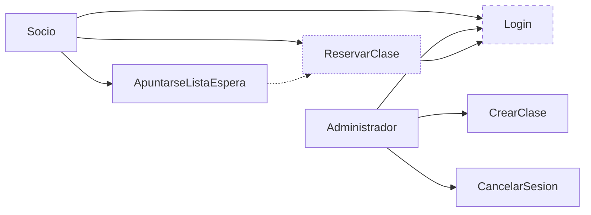
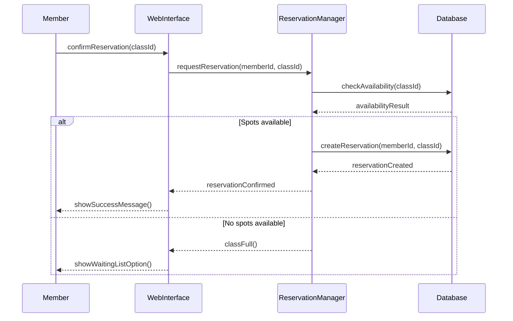
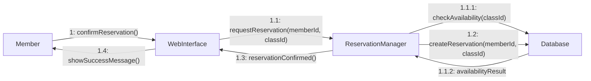
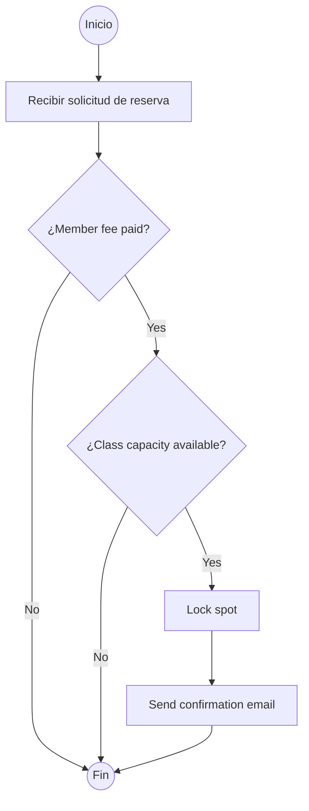
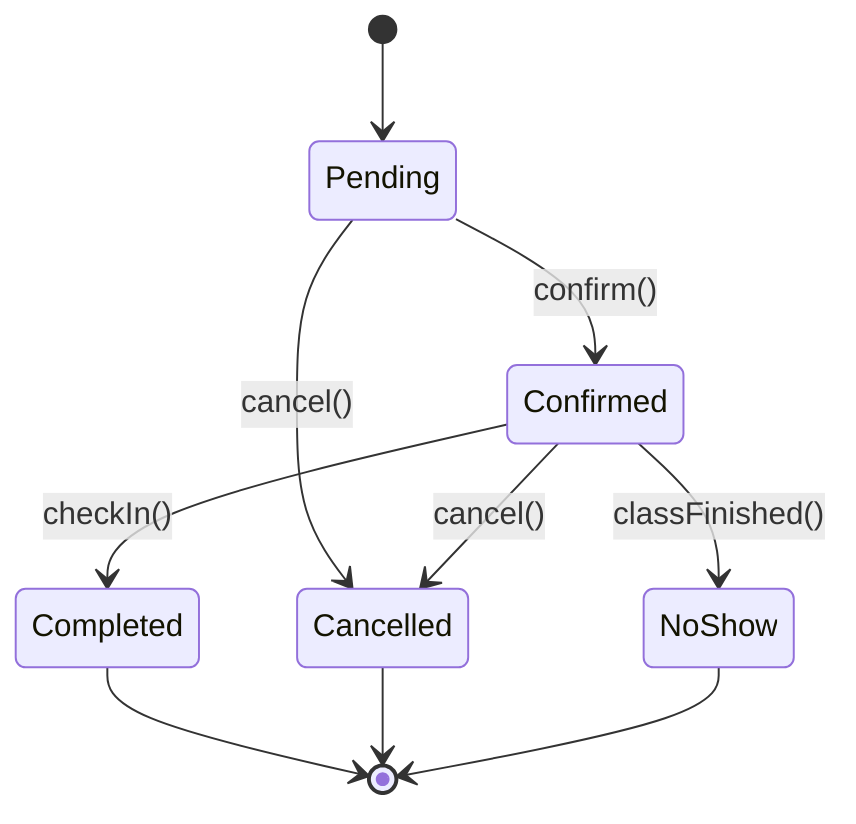

# Entornos-7.5

## TAREA 1

```mermaid
flowchart LR

Socio --> Login
Socio --> ReservarClase
Socio --> ApuntarseListaEspera

Administrador --> Login
Administrador --> CrearClase
Administrador --> CancelarSesion

ReservarClase --> Login:::include
ApuntarseListaEspera -.-> ReservarClase:::extend

classDef include stroke-dasharray: 5 5
classDef extend stroke-dasharray: 2 2
```

## TAREA 2

```mermaid
sequenceDiagram

participant Member
participant WebInterface
participant ReservationManager
participant Database

Member ->> WebInterface: confirmReservation(classId)

WebInterface ->> ReservationManager: requestReservation(memberId, classId)

ReservationManager ->> Database: checkAvailability(classId)

Database -->> ReservationManager: availabilityResult

alt Spots available
ReservationManager ->> Database: createReservation(memberId, classId)
Database -->> ReservationManager: reservationCreated

ReservationManager -->> WebInterface: reservationConfirmed
WebInterface -->> Member: showSuccessMessage()

else No spots available
ReservationManager -->> WebInterface: classFull()
WebInterface -->> Member: showWaitingListOption()

end
```

## TAREA 3

```mermaid
graph LR

Member["Member"]
WebInterface["WebInterface"]
ReservationManager["ReservationManager"]
Database["Database"]

Member -- "1: confirmReservation()" --> WebInterface

WebInterface -- "1.1: requestReservation(memberId, classId)" --> ReservationManager

ReservationManager -- "1.1.1: checkAvailability(classId)" --> Database

Database -- "1.1.2: availabilityResult" --> ReservationManager

ReservationManager -- "1.2: createReservation(memberId, classId)" --> Database

ReservationManager -- "1.3: reservationConfirmed()" --> WebInterface

WebInterface -- "1.4: showSuccessMessage()" --> Member
```

## TAREA 4

```mermaid
flowchart TD

Start((Inicio))

A[Recibir solicitud de reserva]

B{¿Member fee paid?}

C{¿Class capacity available?}

D[Lock spot]

E[Send confirmation email]

End((Fin))

Start --> A

A --> B

B -- No --> End
B -- Yes --> C

C -- No --> End
C -- Yes --> D

D --> E

E --> End
```

## TAREA 5

```mermaid
stateDiagram-v2

[*] --> Pending

Pending --> Confirmed: confirm()

Pending --> Cancelled: cancel()

Confirmed --> Cancelled: cancel()

Confirmed --> Completed: checkIn()

Confirmed --> NoShow: classFinished()

Completed --> [*]

Cancelled --> [*]

NoShow --> [*]
```
